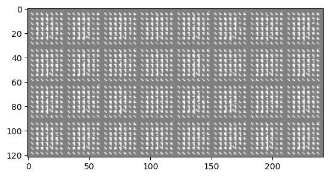

# Image Generation with GANs - MNIST Dataset

In this project, the goal is to implement a Generative Adversarial Network (GAN) with the MNIST dataset to generate digit images using Pytorch.

-----------------------
## Experiments Performed

To train our GAN model, several experiments had to be performed to attempt to stablize the model. I quickly found that GAN models are incredibly sensitive to hyperparameter tuning, so even small changes in parameters can greatly affect the results. Some of the most notable experiments included:

1. Number of layers and network architecture - The initial approach was to flatten the vectors to 1d vectors, however I decided to treat each input as a 2d 28 x 28 vector. Convolutional layers were added to that each model acts as a CNN. Here is the final architecture of the models that I implemented:

        Generator(
            (model): Sequential(
                (0): ConvTranspose2d(100, 256, kernel_size=(7, 7), stride=(1, 1))
                (1): BatchNorm2d(256, eps=1e-05, momentum=0.1, affine=True, track_running_stats=True)
                (2): ReLU(inplace=True)
                (3): ConvTranspose2d(256, 128, kernel_size=(4, 4), stride=(2, 2), padding=(1, 1))
                (4): BatchNorm2d(128, eps=1e-05, momentum=0.1, affine=True, track_running_stats=True)
                (5): ReLU(inplace=True)
                (6): ConvTranspose2d(128, 1, kernel_size=(4, 4), stride=(2, 2), padding=(1, 1))
                (7): Tanh()
                )
            )
        Discriminator(
            (model): Sequential(
                (0): Conv2d(1, 128, kernel_size=(4, 4), stride=(2, 2), padding=(1, 1))
                (1): LeakyReLU(negative_slope=0.2, inplace=True)
                (2): Dropout(p=0.3, inplace=False)
                (3): Conv2d(128, 256, kernel_size=(4, 4), stride=(2, 2), padding=(1, 1))
                (4): BatchNorm2d(256, eps=1e-05, momentum=0.1, affine=True, track_running_stats=True)
                (5): LeakyReLU(negative_slope=0.2, inplace=True)
                (6): Dropout(p=0.3, inplace=False)
                (7): Conv2d(256, 1, kernel_size=(7, 7), stride=(1, 1))
                (8): Sigmoid()
            )
        )

2. Hyperparameter Tuning - This step required numerous iterations of trial and error to produce stable models. Different activation functions, num_epochs, and batch sizes were experimented with. In the end, I decided to go with 200 epochs and a batch size of 32. GANs typically take a long time to train so computational restraints also played into the rationale behind these decisions.

3. Learning Rate and Optimizers - These models were incredibly responsive to different learning rate and optimizers during training. Even an adjustment of .0001 in learning rate lead to instability between the models. Initial lr and optimizers:

        Generator: Adam Optimizer, learning rate of .0001
        Discriminator: Adam Optimizer, learning rate of .0004

These initial parameters were mostly arbitrary and needed constant adjustments. There were often times were even changing the learning rate slightly could lead to one of the models completely overpowering the other. After a good amount of testing, the best combination I found was:

        Generator: Adam Optimizer, learning rate of .0002
        Discriminator: SGD Optimizer, learning rate of .0002

This combination ended up leading to more stable testing, and the losses of the two models oscillated throughout training. Using SGD for the discriminator seemed to be the right choice (as shown in the GAN hacks repo), as ADAM mostly lead to the discriminator becoming too powerful for the generator to learn on.

-----------------------
### Special Skills Implemented

To better improve the model stability, several special skills and tips were experimented with. Here are the results from the skills implemented:

1. Normalizing the inputs. Image inputs were normalized between -1 and 1 and Tanh was used at the output layer of the generator.

2. Label Smoothing. This step required a fair amount of experimentation. For each sample, I replaced the label (either 1 or 0) with a random number between .7 and 1 for real, and between 0 and .3 for fake. This process seems to work and allows for better discriminator training, although sometimes leading to a discriminator that was too accurate for the generator to fool.

3. Label Flipping. For the discriminator, the labels were flipped. In the case of non flipped labels, I noticed this lead to a generator loss of near 0. This lead to very poor generations so I elected to keep label flipping in the training loop.

4. Varied amounts of discriminator/generator training. For example, I experimented with training the generator twice for every time te discriminator was trained. Initially, this seemed to work and produced stable, oscillating losses. However, as training continued the losses began to diverge and the models were no longer learning from each other. In the future, it would be worth further experimenting with this (for example, only retrain generator is loss > x).

5. Using SGD for discriminator optimizer. This tip certainly helped for creating a stable training environment and prevented the discriminator from learning too quickly.

------------------------
### Visualization and Results

Loss of Generator and Discriminator during training:

Generated Images:

Initial Generated Images:

After 10 Epochs:

After 200 Epochs:

25 Generated Images:

The results from this GAN training were mediocre and there is still room for improvement. The digits generated by the generator model still could have been better and closer to the true data. However, the generated digits are mostly still legible, and we were able to succesffuly train a somewhat stable GAN with oscillating training losses.

In the future, more experimentation is needed to produce more accurate digits. For the purposes of this project, these results will suffice.

------------------------
### Conclusion

This project gave some good experience in training a generative adversarial network. The challenges of training this network was quickly apparent and it took quite a bit of experimentation to create a stable training environment. There is certainly room for improvement in this notebook and with further testing hopefully we will be able to generate digits indistinguishable from the MNIST dataset.

------------------------
### References

https://github.com/soumith/ganhacks - for tips on training GANs